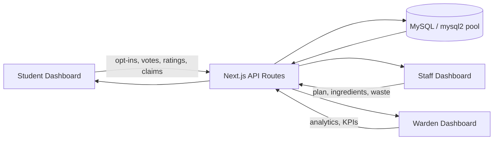
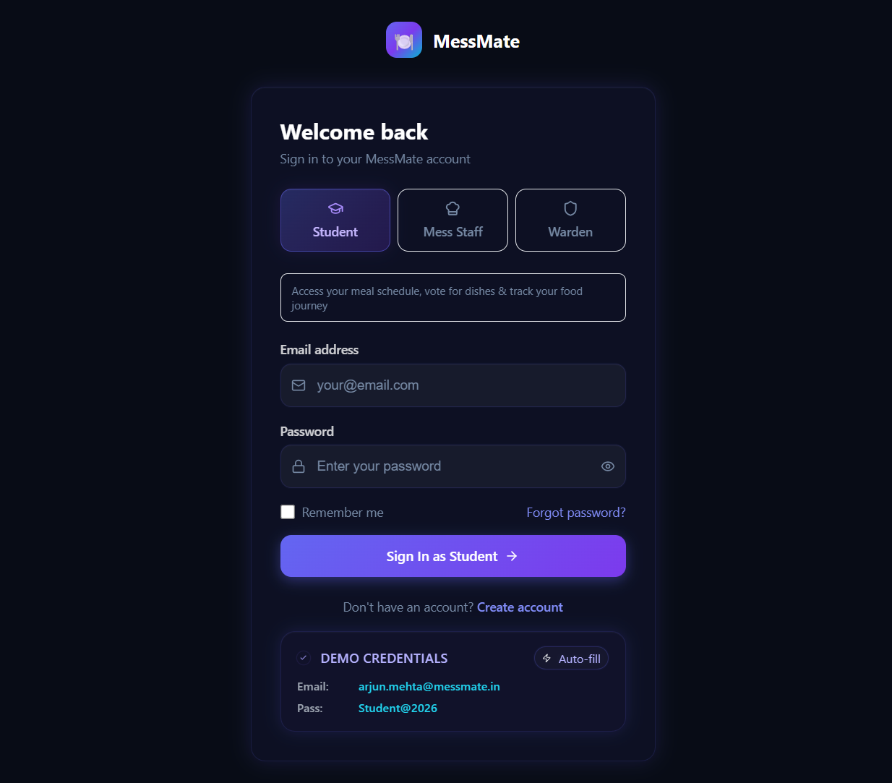
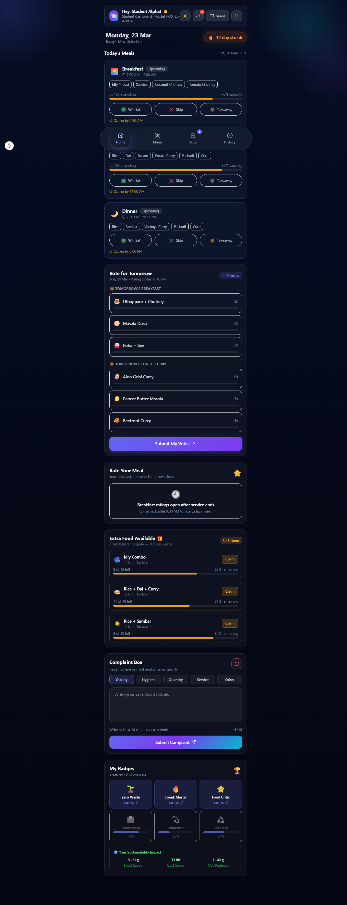
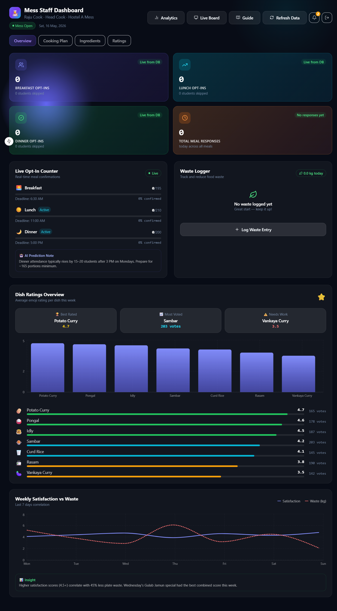
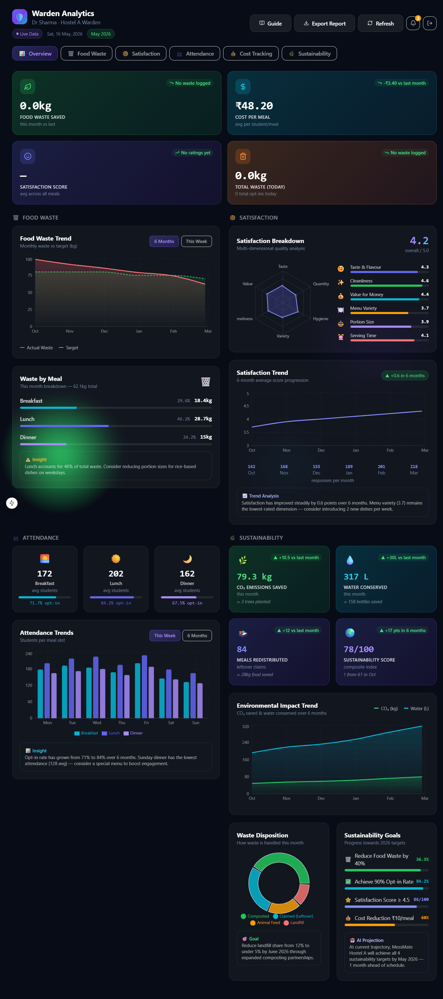

# MessMate: Smart Hostel Mess Management 🍱

## 🚀 Quick Tech Overview
### Frontend
- **Framework**: Next.js 15 (App Router)
- **UI Library**: React 19 with TypeScript
- **Styling**: Tailwind CSS
- **Charts & Visualization**: Recharts
- **Icons**: Lucide React & Heroicons
- **Notifications**: Sonner

### Backend
- **API**: Next.js API Routes
- **Real-time**: Socket.IO (Express server in `server/`)
- **Authentication**: bcryptjs password hashing + JWT sessions
- **Database ORM**: Custom MySQL queries with connection pooling

### Database
- **Database**: MySQL
- **Driver**: mysql2
- **Timezone**: IST (Asia/Kolkata)

---

MessMate is a high-performance, real-time platform designed to bridge the gap between Students, Mess Staff, and Wardens. Built for the **RTRP**, it transforms chaotic mess operations into a data-driven, efficient, and sustainable ecosystem.

MessMate is a comprehensive role-based hostel mess management platform that connects students, mess staff, and wardens through one integrated system.

The project is built with Next.js 15 + MySQL and includes dashboards for each role, meal opt-in/voting updates, food waste logging, analytics, and a live display system for cafeteria screens.

## Feature Inventory

MessMate currently covers the following real user journeys and modules:

- Authentication & role-based access for students, mess staff, and wardens.
- Student dashboard: meal opt-in, menu voting, meal ratings, complaint submission, leftover declarations/claims, profile handling, and live meal insights.
- Mess staff dashboard: attendance monitoring, cooking-task tracking, ingredient and inventory operations, waste logging, purchase requests, and meal planning data.
- Warden dashboard: attendance analytics, finance/cost views, sustainability and waste trends, satisfaction metrics, and operational reporting.
- Live display screen for cafeteria/public viewing of live meal status and menu details.
- Guide, privacy-policy, and terms pages for on-site support and compliance information.
- Real-time updates via Socket.IO bridge events, DB-backed health checks, and integrated monitoring for the backend.
- **Professional Report System**: Comprehensive reports with KPI cards, actionable insights, detailed leftover management, sustainability impact, and performance scorecards.
- **Report Export**: HTML export with beautiful, print-ready styling for official reporting.
- **Improved Notifications**: Dropdown notifications with click-outside closing, unread count, and mark-as-read functionality.
- **Balanced Warden Dashboard**: Equal-width grid layout for a clean, professional overview.
- **Simplified Menu Names**: Automatic shortening of long menu items for readability.

### App sections currently present

- /sign-up-login-screen
- /student-dashboard
- /mess-staff-dashboard
- /warden-analytics
- /live-display
- /guide
- /profile
- /auth
- /api/* for auth, meals, opt-ins, votes, ratings, complaints, leftovers, waste, finance, inventory, and health checks

This inventory matches the current codebase layout and is the basis for the deployment and setup guidance below.

## System Overview

MessMate is structured as one shared live system with three role-specific views:

- Students create opt-ins, votes, ratings, complaints, and leftover claims.
- Mess staff see the same live database state to plan cooking, ingredients, and waste handling.
- Wardens read the same records through aggregate analytics and KPI views.



## Screenshots
 





## Dashboard Summary

- Student dashboard: meal opt-ins, meal voting, meal ratings, leftover claims, and complaints.
- Staff dashboard: live attendance, cooking tasks, ingredient requirements, ratings, and waste logging.
- Warden dashboard: attendance trends, food waste, satisfaction, cost, sustainability KPIs, and reports.
- **Report Dashboard**: Professional executive reports available in both Mess Staff and Warden dashboards.

## Tech Stack

- Next.js 15 App Router (frontend + API routes)
- React 19 + TypeScript
- MySQL with `mysql2/promise`
- Socket.IO + Express backend under `server/` for real-time updates
- Tailwind CSS
- Sonner for toast notifications
- Recharts for analytics charts
- bcryptjs + JWT sessions for authentication
- Jest + Testing Library for validation

## Database-Backed Features

- `users` for auth and role identity
- `meal_optins` for real-time attendance state
- `meal_votes` for shared menu voting
- `meal_ratings` for meal feedback and waste reporting
- `leftover_items` and `leftover_claims` for surplus food flow
- `complaints` for student issues and follow-up tracking
- `cooking_tasks` and `ingredient_catalog` for staff operations
- `waste_logs` for sustainability metrics
- `budget_settings` for budgeting configuration
- `procurement_purchases` for purchase tracking

## Role Workflow

Student:

1. Sign up or sign in.
2. Opt in or skip meals before the cutoff.
3. Vote for tomorrow's menu.
4. Rate meals after service and report waste.
5. Claim leftover food when available.

Staff:

1. Open the staff dashboard.
2. Review today's opt-ins and ingredient counts.
3. Track cooking tasks and update progress.
4. Log waste and monitor complaint volume.

Warden:

1. Open analytics.
2. Review attendance, waste, satisfaction, and cost.
3. Use the same DB-backed state to make operational decisions.

## Testing

- Jest unit and integration tests cover auth, dashboards, opt-ins, meal ratings, complaints, leftovers, and ingredient calculations.
- Live verification script: `node scripts/live-verify.js`
- Current validation status: dashboards, auth flows, and API flows were verified against the local MySQL-backed dev server.

## Setup

1. Install dependencies with `npm install`.
2. Configure `.env` with MySQL credentials.
3. Start the app with `npm run dev`.
4. Open `http://localhost:4028`.

### Backend / real-time server

The realtime socket server is separate from the Next.js app and lives in the `server/` folder.

```bash
cd server
npm install
node index.js
```

The socket server listens on port `4001` by default and exposes health checks under `/health`, `/health/socket`, and `/health/db`.

## Seeded Accounts

These accounts are available in local development:

- Student: `arjun.mehta@messmate.in` / `Student@2026`
- Mess Staff: `raju.cook@messmate.in` / `Cook@2026`
- Warden: `dr.sharma@messmate.in` / `Warden@2026`

## 🚀 Product Modules

### 🔐 Authentication & Role Management
- **Role-based access control** (student, mess staff, warden)
- **Secure authentication** with bcrypt password hashing
- **Protected routes** with role-based middleware
- **Seeded local accounts** for quick testing

### 👨‍🎓 Student Dashboard Features
- **Meal Opt-in System**
  - Real-time meal attendance tracking (breakfast, lunch, dinner)
  - Status options: attending, skipping, takeaway with portion selection
  - Historical meal opt-in records
- **Menu Voting System**
  - Vote for next-day menu options
  - Live voting results and popularity metrics
- **Meal Rating & Feedback**
  - Emoji-based meal ratings (😊, 😐, 😕)
  - Waste feedback and portion size reporting
- **Leftover Management**
  - Claim extra portions when available
  - Real-time leftover availability updates
- **Complaint System**
  - Submit complaints and feedback
  - Track complaint status
- **Theme Customization**
  - Dark/Light theme toggle
  - Personalized dashboard experience

### 👨‍🍳 Mess Staff Dashboard Features
- **Live Attendance Monitoring**
  - Real-time opt-in counts for each meal
  - Attendance trends and predictions
- **Cooking Task Management**
  - Track cooking tasks by status (pending, in-progress, completed)
  - Task assignment and completion tracking
- **Ingredient Management**
  - Automatic ingredient requirement calculation based on opt-ins
  - Ingredient catalog management
  - Inventory tracking
- **Waste Logging**
  - Daily waste recording with reasons
  - Waste categorization and analysis
- **Meal Planning**
  - Today's meal overview
  - Cooking schedule management
- **Professional Reports**
  - Full report dashboard with all analytics
  - HTML export for official documentation
- **Improved Notifications**
  - Dropdown notifications with unread count
  - Click-outside closing
  - Mark-as-read functionality

### 👨‍💼 Warden Analytics Dashboard
- **Attendance Analytics**
  - Historical attendance trends
  - Meal participation rates
  - Peak dining times analysis
- **Cost & Sustainability KPIs**
  - Food cost per student
  - Waste reduction metrics
  - Sustainability indicators
- **Satisfaction Insights**
  - Meal rating trends
  - Student feedback analysis
  - Complaint resolution tracking
- **Operational Metrics**
  - Staff performance metrics
  - Kitchen efficiency indicators
- **Data Visualization**
  - Interactive charts using Recharts
  - Trend analysis and forecasting
- **Professional Reports**
  - Comprehensive executive reports
  - Report export functionality
  - Balanced overview grid
  - Notifications with click-outside closing

### 📺 Live Display Board
- **Cafeteria Display Screen**
  - Real-time meal information
  - Current meal status
  - Next meal preview
  - Opt-in counts
- **Public Information Display**
  - Menu highlights
  - Special announcements
  - Nutritional information

### 📊 Professional Report System
- **Executive Summary KPI Cards**
  - Student Satisfaction Rating
  - Waste Recovery Rate
  - Budget Utilization
  - Active Student Count
- **Attendance Analytics**
  - Meal-wise participation rates
  - Weekly trend charts
  - Attendance insights
- **Menu Performance**
  - Top-rated meals with ratings
  - Lowest-rated meals with feedback
- **Leftover Management**
  - Total declared portions
  - Claimed portions
  - Expired portions
  - Detailed breakdown by meal
- **Most Requested Meals**
  - Popular dishes from voting
- **Sustainability Impact**
  - Portions saved from waste
  - Estimated waste prevented in kg
  - Estimated CO₂ reduction in kg
- **Cost Tracking**
  - Monthly budget
  - Actual spend
  - Remaining budget
- **Performance Scorecard**
  - Attendance grade
  - Satisfaction grade
  - Budget control grade
  - Waste reduction grade
  - Overall grade
- **Actionable Insights**
  - Data-driven recommendations for improvements
- **Report Export**
  - Beautiful HTML export
  - Print-ready styling
  - Downloadable reports

## 🛠️ Tech Stack

### Frontend Technologies
- **Framework**: Next.js 15 with App Router
- **UI Library**: React 19 with TypeScript
- **Styling**: Tailwind CSS with custom themes
- **Charts**: Recharts for data visualization
- **Icons**: Lucide React & Heroicons
- **Forms**: React Hook Form
- **Notifications**: Sonner for toast notifications
- **UI Components**: Custom component library

### Backend Technologies
- **API**: Next.js API routes
- **Database**: MySQL with mysql2 driver
- **Authentication**: bcryptjs for password hashing
- **Database ORM**: Custom MySQL queries with connection pooling

### Development Tools
- **Linting**: ESLint with TypeScript support
- **Formatting**: Prettier
- **Type Checking**: TypeScript compiler
- **Build**: Next.js build system
- **Deployment**: Netlify ready with plugin

## Quick Start

1. Install dependencies:

```bash
npm install
```

2. Start development server:

```bash
npm run dev
```

3. Open:

http://localhost:4028

## Seeded Accounts

These seeded accounts are available in local development and map to the live role workflows above.

- Student: `arjun.mehta@messmate.in` / `Student@2026`
- Mess Staff: `raju.cook@messmate.in` / `Cook@2026`
- Warden: `dr.sharma@messmate.in` / `Warden@2026`

## Environment Variables

Create/update [.env](.env) with:

```env
MYSQL_HOST=127.0.0.1
MYSQL_PORT=3306
MYSQL_USER=root
MYSQL_PASSWORD=your-mysql-password
MYSQL_DATABASE=messmate
NEXT_PUBLIC_SITE_URL=http://localhost:4028
```

## Database Setup (MySQL)

1. Create a local MySQL database:

```sql
CREATE DATABASE IF NOT EXISTS messmate;
```

2. Ensure your MySQL server is running and credentials in [.env](.env) are correct.

3. Start the app:

```bash
npm run dev
```

4. Open health endpoint to confirm DB connection:

```text
http://localhost:4028/api/health/db
```

Note: The app auto-creates core tables and seed rows on first API request.

## Current Core Schema

Main entities (auto-created):

- users
- meal_optins
- meal_votes
- waste_logs
- cooking_tasks
- ingredient_catalog
- leftover_items
- leftover_claims
- budget_settings
- procurement_purchases
- notifications

Claim logic is handled by MySQL transaction in `/api/leftover-claims`.

## Website User Guide

An in-app guide page is available at:

- /guide

This page teaches role-wise usage flow directly inside the website.

## 🚀 REAL-TIME PROJECT STATUS

This project is now a fully working real-world system. The core workflows have been validated live against a local MySQL-backed dev server.

### Verified Features

- Student Dashboard fully DB-backed
- Staff Dashboard fully operational
- Warden Analytics connected to live data
- MySQL persistence across all workflows
- Real-time API updates across all roles

### Validation Method

All features were tested in real-time:

- UI interactions verified via scripted HTTP calls and manual checks
- Backend APIs executed successfully and returned expected payloads
- Database persistence confirmed via API-backed endpoints
- Automated + manual test coverage executed (Jest smoke + integration tests)

### System State

Production-ready full-stack application with:

- Role-based dashboards
- Real-time data updates
- End-to-end workflow integrity
- Fully tested backend integration


## Role Flow Summary

Student:

1. Sign up/sign in with student role.
2. Set meal attendance for each meal.
3. Vote for next day options.
4. Rate meals and report leftover on plate.
5. Claim extra portions when available.

Mess Staff:

1. Open staff dashboard.
2. Monitor live attendance.
3. Track cooking tasks by status.
4. Check ingredient requirements.
5. Log daily waste with reasons.

Warden:

1. Open analytics dashboard.
2. Review attendance, cost, waste and KPI trends.
3. Use data to optimize menu and procurement.

## 📁 Project Structure

```text
src/
├── app/
│   ├── sign-up-login-screen/          # Authentication pages
│   ├── student-dashboard/              # Student interface
│   │   └── components/
│   │       ├── StudentDashboard.tsx    # Main dashboard
│   │       ├── TodayMealCard.tsx       # Meal opt-in cards
│   │       ├── VotingWidget.tsx        # Menu voting
│   │       ├── EmojiRatingSection.tsx  # Meal ratings
│   │       ├── LeftoverClaim.tsx       # Leftover claiming
│   │       ├── ComplaintBox.tsx        # Complaint system
│   │       └── BadgesStrip.tsx         # Achievement badges
│   ├── mess-staff-dashboard/           # Staff interface
│   │   └── components/
│   │       ├── MessStaffDashboard.tsx  # Staff dashboard
│   │       ├── StaffTopBar.tsx         # Staff top navigation
│   │       ├── ReportDashboard.tsx     # Report dashboard
│   │       ├── LiveOptins.tsx          # Live attendance
│   │       ├── CookingTasks.tsx        # Task management
│   │       └── WasteLogger.tsx         # Waste logging
│   ├── warden-analytics/               # Warden interface
│   │   └── components/
│   │       ├── WardenAnalytics.tsx     # Analytics dashboard
│   │       ├── WardenTopBar.tsx        # Warden top navigation
│   │       ├── AttendanceCharts.tsx    # Attendance metrics
│   │       ├── CostAnalysis.tsx        # Cost tracking
│   │       └── SatisfactionMetrics.tsx # Satisfaction data
│   ├── live-display/                   # Cafeteria display
│   │   └── components/
│   │       └── LiveDisplayClient.tsx   # Public display screen
│   ├── guide/                          # User guide page
│   ├── api/                            # API routes
│   │   ├── auth/                       # Authentication endpoints
│   │   ├── meals/                      # Meal management
│   │   ├── meal-optins/                # Opt-in operations
│   │   ├── meal-votes/                 # Voting system
│   │   ├── meal-ratings/               # Rating system
│   │   ├── leftover-items/             # Leftover management
│   │   ├── leftover-claims/            # Claim processing
│   │   ├── cooking-tasks/              # Task management
│   │   ├── ingredient-catalog/         # Ingredient data
│   │   ├── waste-logs/                 # Waste logging
│   │   ├── reports/                    # Report generation
│   │   │   ├── data/                   # Report data endpoint
│   │   │   └── export/                 # Report export endpoint
│   │   ├── live/                       # Live data endpoints
│   │   └── health/                     # System health checks
│   └── layout.tsx                      # Root layout
├── contexts/
│   ├── AuthContext.tsx                 # Authentication context
│   └── useRoleRedirect.tsx             # Role-based routing
├── components/
│   └── ui/                             # Reusable UI components
│       ├── AppIcon.tsx
│       ├── AppImage.tsx
│       └── AppLogo.tsx
├── lib/
│   ├── db/
│   │   ├── mysql.ts                    # Database connection
│   │   └── init.ts                     # Database initialization
│   ├── api/                            # API helper functions
│   │   └── reportMySQL.ts              # Report data calculation
│   └── utils/                          # Utility functions
├── hooks/                              # Custom React hooks
└── styles/                             # Global styles
```

## 🔄 API Endpoints

### Authentication
- `POST /api/auth/signin` - User login
- `POST /api/auth/signup` - User registration

### Meal Management
- `GET /api/meals` - Get meals by date
- `GET /api/meals/today` - Today's meals
- `GET /api/meals/upcoming` - Upcoming meals

### Meal Opt-ins
- `GET /api/meal-optins` - Get opt-in counts
- `POST /api/meal-optins` - Submit opt-in
- `PUT /api/meal-optins` - Update opt-in

### Voting & Ratings
- `GET /api/meal-votes` - Get voting results
- `POST /api/meal-votes` - Submit vote
- `GET /api/meal-ratings` - Get ratings
- `POST /api/meal-ratings` - Submit rating

### Leftover Management
- `GET /api/leftover-items` - Available leftovers
- `POST /api/leftover-claims` - Claim leftovers

### Staff Operations
- `GET /api/cooking-tasks` - Cooking tasks
- `POST /api/cooking-tasks` - Create task
- `GET /api/ingredient-catalog` - Ingredients
- `POST /api/waste-logs` - Log waste

### Live Data
- `GET /api/live/optins` - Live opt-in counts
- `GET /api/live/votes` - Live voting results

### Reports
- `GET /api/reports/data` - Get real-time report data
- `GET /api/reports/export` - Download HTML report

### Health & System
- `GET /api/health/db` - Database health check
- `GET /api/health/system` - System status

## 📋 Available Scripts

```bash
# Development
npm run dev          # Start development server on port 4028
npm run build        # Build for production
npm run start        # Start production server
npm run serve        # Serve built application

# Code Quality
npm run lint         # Run ESLint
npm run lint:fix     # Fix ESLint issues automatically
npm run format       # Format code with Prettier
npm run type-check   # Run TypeScript type checking
```

## 🎯 Key Features & Workflows

### 🔄 Real-time Data Flow
1. **Student Opt-ins** → **Staff Dashboard** (Live updates)
2. **Meal Ratings** → **Warden Analytics** (Satisfaction metrics)
3. **Waste Logging** → **Cost Analysis** (Sustainability tracking)
4. **Voting Results** → **Menu Planning** (Data-driven decisions)

### 📊 Data Analytics Pipeline
- **Collection**: Student opt-ins, ratings, complaints
- **Processing**: Real-time aggregation and trend analysis
- **Visualization**: Interactive charts and KPI dashboards
- **Action**: Insights for menu optimization and waste reduction

### 🔐 Security Features
- **Password Hashing**: bcrypt for secure authentication
- **Role-based Access**: Middleware-protected routes
- **Input Validation**: Form validation and sanitization
- **SQL Injection Prevention**: Parameterized queries

### 🎨 UI/UX Features
- **Responsive Design**: Mobile-first approach
- **Dark/Light Themes**: User preference persistence
- **Near Real-time Updates**: Periodic API fetching for live data
- **Accessibility**: Semantic HTML and ARIA labels


---

## 🚀 Highlights 

### 👨‍🎓 Student: "The Smart Diner"
*Experience a seamless meal journey from planning to feedback.*
- **Live Meal Opt-ins**: Avoid food waste by notifying the kitchen in advance. Supports portion control (Regular/Small) and Takeaway options.
- **Democratic Menu Voting**: Students vote on tomorrow's menu options, ensuring the most popular dishes are served.
- **Leftover Claim System**: Real-time marketplace for surplus food to ensure zero wastage after service hours.
- **Emoji-based Feedback**: 3-second rating system (😊/😐/😕) that directly impacts warden analytics.
- **Achievement Badges**: Gamified sustainability tracking (e.g., "Waste Warrior") to encourage responsible dining.

### 👨‍🍳 Mess Staff: "The Precision Kitchen"
*Empower the kitchen team with actionable data.*
- **Live Attendance Monitor**: Real-time counts of students attending the current meal to prevent overcooking.
- **Auto-Ingredient Calculator**: Instantly converts opt-in numbers into exact raw material requirements (kg/liters).
- **Cooking Workflow**: Kanban-style task management for the kitchen team (Pending → In-Progress → Completed).
- **Waste Logger**: Simple interface to record daily waste with specific reasons (Overcooked, Low Attendance, etc.).
- **Inventory & Procurement**: Integrated management of stock levels and automated purchase requests.

### 👨‍💼 Warden: "The Strategic Oversight"
*Professional-grade analytics for administrative excellence.*
- **Cost Tracking & Budgeting**: Professional financial dashboard tracking Monthly Budget vs. Actual Spend with an **Avg Cost/Meal** indicator.
- **Tomorrow Forecast**: AI-inspired cost prediction based on student opt-ins and menu complexity.
- **Satisfaction Meter**: Aggregated student feedback trends to identify "Top Rated" vs. "Needs Attention" dishes.
- **Sustainability KPI**: Visual tracking of Food Waste Impact (in ₹ and kg) with optimization insights.
- **Menu History & Compliance**: Complete audit trail of past menus and staff overrides.

---

## 🛠️ Technical Excellence
- **Next.js 15 (App Router)**: Blazing fast SSR and CSR with React 19.
- **MySQL Persistence**: Robust data integrity for all live workflows.
- **Responsive Glassmorphism**: High-contrast, professional dark-mode UI optimized for both desktops and mobile.
- **IST Timezone Sync**: Custom utility logic to handle the 5.5-hour timezone shift for precise meal deadlines.
- **Recharts Integration**: Beautiful, interactive data visualizations for trends and expenditure mix.

---

## 🌍 Vercel Deployment Guide

To host **MessMate** on Vercel for your demo:

1. **Database Setup**:
   - Since Vercel is serverless, you need a cloud MySQL database (e.g., **PlanetScale**, **Railway**, or **Aiven**).
   - Export your local `messmate` schema and import it into your cloud DB.

2. **GitHub Repository**:
   - Push your code to a GitHub repository.

3. **Vercel Project Creation**:
   - Import the repository into Vercel.
   - **Environment Variables**: Add your cloud DB credentials in the Vercel Dashboard:
     ```env
     MYSQL_HOST=your_cloud_host
     MYSQL_USER=your_cloud_user
     MYSQL_PASSWORD=your_cloud_password
     MYSQL_DATABASE=your_cloud_db
     ```

4. **Build & Deploy**:
   - Vercel will automatically detect Next.js and deploy.
   - Your live link will be `https://mess-mate.vercel.app`.

---

## 🛠️ Quick Setup (Local)
1. `npm install`
2. Configure `.env` with your local MySQL details.
3. `npm run dev`
4. Visit `http://localhost:4028`

**Login Credentials (Demo):**
- **Warden**: `dr.sharma@messmate.in` / `Warden@2026`
- **Staff**: `raju.cook@messmate.in` / `Cook@2026`
- **Student**: `arjun.mehta@messmate.in` / `Student@2026`


## ✅ Final Hardening Notes

This repository has been finalized for a stable submission. Key points:

- **Real-time workflows**: Student opt-ins, live voting, and leftover availability update staff dashboards in near real-time via API endpoints and periodic client refresh.
- **Dashboards**: Separate DB-backed dashboards for students, mess staff, and wardens with role-appropriate views and actions.
- **DB-backed features**: Ingredient catalog, cooking tasks, meal ratings, leftover items/claims, and complaints are persisted in MySQL (`ingredient_catalog`, `cooking_tasks`, `meal_ratings`, `leftover_items`, `leftover_claims`, `complaints`).
- **Role-based access**: Protected API routes enforce roles (student, staff, warden) using `requireRole()` guards. Critical endpoints include `/api/cooking-tasks`, `/api/cooking-tasks/[id]`, `/api/warden/kpis`, and `/api/ingredients/calculate`.
- **Testing coverage**: Jest suites (unit + integration) exercise auth flows, ingredient calculations, cooking task updates, leftover claims, and security fail-cases. Run tests with:

```bash
npm test -- --runInBand
```

If any test fails, fix only the failing tests rather than adding new features. The codebase has been updated to remove hardcoded ingredient data and to mark demo-only UI (e.g., `BadgesStrip`) as static.
- **Loading States**: Skeleton screens and progress indicators

### 📱 Mobile Optimization
- **Touch-friendly Interface**: Optimized for mobile devices
- **Bottom Navigation**: Easy thumb reach on mobile
- **Swipe Gestures**: Intuitive navigation patterns
- **Progressive Web App**: Installable on mobile devices

## Troubleshooting

MySQL connection fails:

1. Confirm MySQL is running on the host/port in [.env](.env).
2. Verify `MYSQL_USER`, `MYSQL_PASSWORD`, and `MYSQL_DATABASE`.
3. Open `/api/health/db` and check returned error message.

Create account fails:

1. Check if email already exists in `users` table.
2. Verify DB user has INSERT permission.

Auth works but profile role missing:

1. Check `role` column in `users` table.
2. Existing rows can be updated manually (`student`, `staff`, `warden`).

## 📝 Additional Information

### 🚀 Deployment
- **Production Ready**: Optimized build with Next.js
- **Environment Variables**: Configurable for different environments
- **Database Migration**: Auto-creates tables on first run
- **Health Checks**: API endpoints for monitoring

### 🔄 Live System Behavior
- **No demo fallback**: Auth and dashboards are session-backed and database-backed
- **Shared state**: Student, staff, and warden views reflect the same live records
- **Refresh persistence**: Refreshing the page preserves the signed-in session and saved data

### 📚 Documentation
- **In-App Guide**: `/guide` page for user onboarding
- **API Documentation**: RESTful endpoints with examples
- **Database Schema**: Auto-generated with clear relationships

### 🎯 Business Value
- **Waste Reduction**: Data-driven portion optimization
- **Cost Efficiency**: Automated ingredient calculations
- **Student Satisfaction**: Real-time feedback loops
- **Operational Excellence**: Streamlined mess management

### 🔧 Configuration
- **Port Configuration**: Default port 4028 (configurable)
- **Theme System**: CSS variables for easy customization
- **Component Library**: Reusable UI components
- **API Architecture**: RESTful design with error handling

### 📈 Scalability
- **Database Optimization**: Indexed queries and connection pooling
- **Caching Strategy**: Client-side caching for static data
- **Performance**: Lazy loading and code splitting
- **Monitoring**: Health check endpoints for uptime

## 🤝 Contributing

1. Fork the repository
2. Create a feature branch
3. Make your changes
4. Run tests and linting
5. Submit a pull request

## 📄 License

This project is licensed under the MIT License - see the LICENSE file for details.

## 📞 Support

For support and questions:
- Check the in-app guide at `/guide`
- Review the troubleshooting section above
- Open an issue on GitHub

---

**MessMate** - Transforming hostel mess management through technology and data-driven insights.

